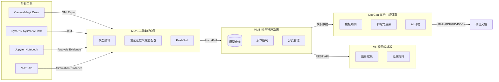
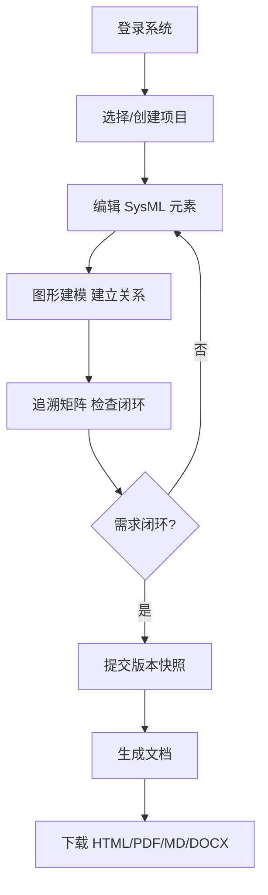

---
hide:
  - toc
---

# SysML DocGen

<figure markdown>
<div align="center" markdown>

基于 SysML 模型的文档自动生成系统

**"模型一次编辑，文档处处复用"**

</div>
</figure>

---

## 系统架构



## 四大组件

<div class="grid cards" markdown>

- :material-database: **MMS 模型管理系统**

    ---

    项目、分支、元素 CRUD、提交快照、标签、差异比较、回滚、合并、审计日志

- :material-eye: **VE 视图编辑器**

    ---

    浏览器内查看和编辑 SysML 元素，展示需求图、结构图、行为图和追踪矩阵

- :material-tools: **MDK 工具集成套件**

    ---

    可复用 Python 客户端、命令行入口、模型来源适配器和验证证据来源适配器

- :material-file-document: **DocGen 文档生成引擎**

    ---

    按模板生成 Markdown、HTML、PDF、Word，并写入模型指纹、来源分支、来源提交和追踪矩阵

</div>

## 快速开始

<div class="grid cards" markdown>

- :material-rocket-launch: **启动系统**

    ---

    ```powershell
    pip install -r requirements.txt
    cd frontend && npm install && npm run build && cd ..
    python server.py --host 127.0.0.1 --port 8000
    ```

    访问 `http://127.0.0.1:8000`

- :material-login: **演示账号**

    ---

    | 用户 | 密码 |
    |------|------|
    | `teacher` | `teacher123` |
    | `engineer` | `engineer123` |
    | `reviewer` | `reviewer123` |

    每个账号拥有独立的示例项目

</div>

## 典型工作流



## 文档导航

| 文档 | 说明 |
|------|------|
| [用户手册](user-manual.md) | 面向最终用户的完整操作指南 |
| [API 文档](api.md) | REST API 接口说明 |
| [MDK 集成](mdk.md) | JSON、XMI/Cameo Export、SysML v2/SysON、Jupyter、MATLAB 接入说明 |
| [后端架构](backend-refactor-notes.md) | 后端分层重构说明 |
| [课设报告](course-design-report.md) | 课程设计报告 |
