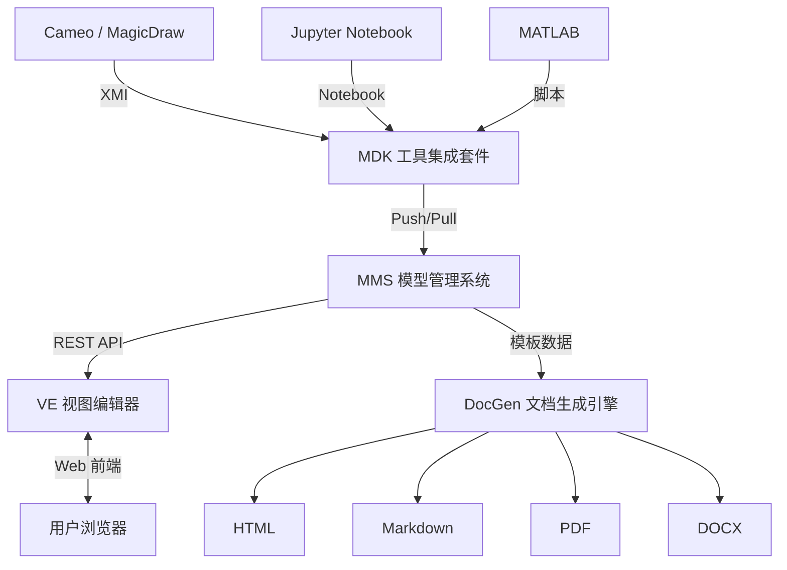
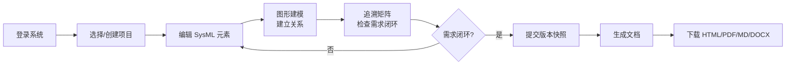
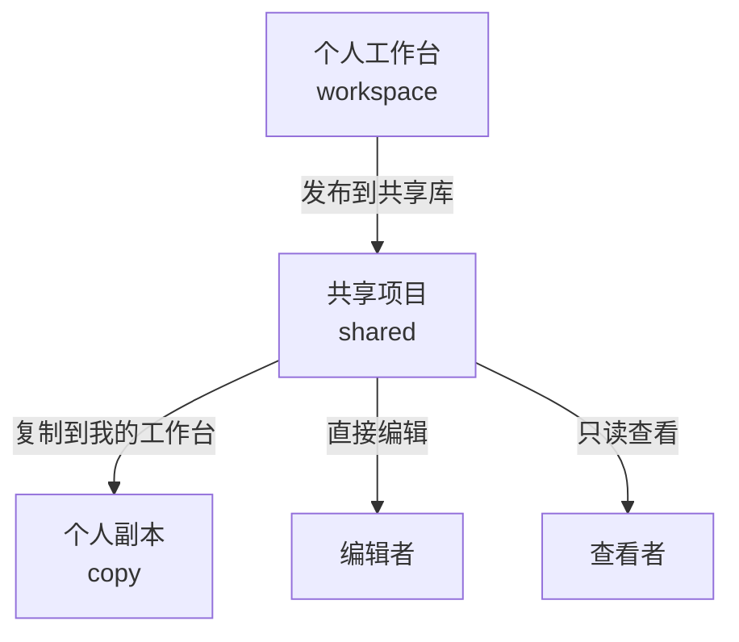
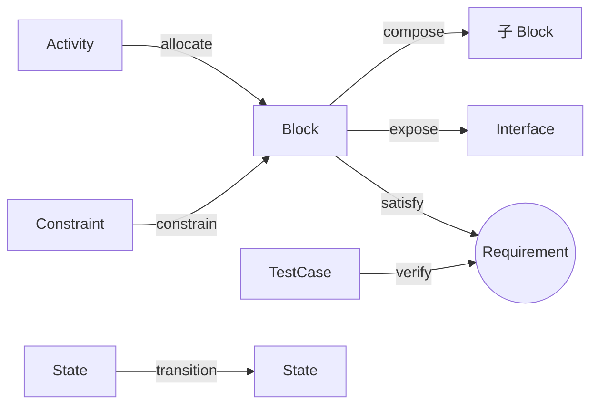
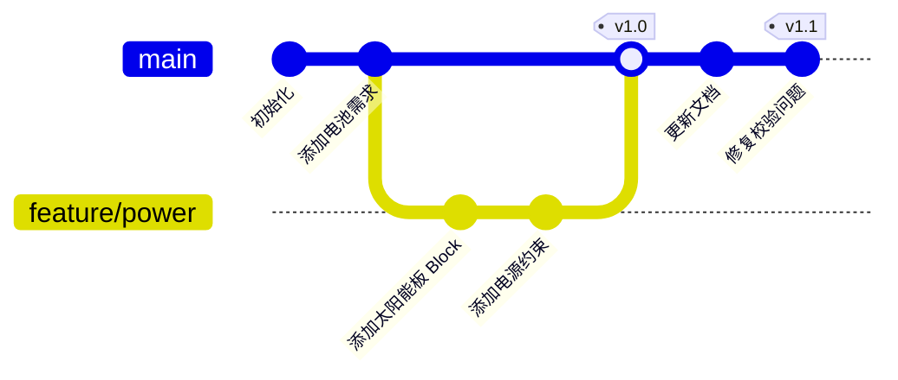
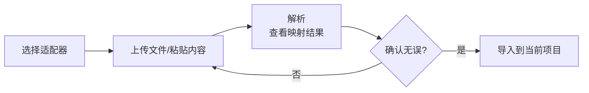

# 用户手册

## 1. 系统概述

SysML DocGen 是一个基于 SysML 模型的文档自动生成系统。核心理念是 **"模型一次编辑，文档处处复用"**——您在系统中建立的 SysML 模型作为唯一可信源，系统自动从中生成一致、可追溯的工程文档。

### 数据流



### 四大组件

<div class="grid cards" markdown>

- :material-database: **MMS**

    ---

    模型存储、版本控制、分支管理、审计日志

- :material-eye: **VE**

    ---

    Web 端模型浏览与编辑、图形化建模、追溯分析

- :material-tools: **MDK**

    ---

    与 Jupyter、MATLAB、Cameo 等外部工具集成

- :material-file-document: **DocGen**

    ---

    基于模板生成 HTML、Markdown、PDF、Word 文档

</div>

---

## 2. 快速入门

### 2.1 启动系统

=== "Windows 本地"

    ```powershell
    # 1. 安装 Python 依赖
    pip install -r requirements.txt

    # 2. 构建前端
    cd frontend
    npm install
    npm run build
    cd ..

    # 3. 启动服务
    python server.py --host 127.0.0.1 --port 8000
    ```

=== "Docker"

    ```powershell
    docker compose up --build
    ```

!!! warning "注意"
    如果 `frontend/dist` 目录不存在，服务会返回错误提示。请确保已执行 `npm run build`。

### 2.2 登录

打开浏览器访问 `http://127.0.0.1:8000`，使用以下演示账号登录：

| 用户名 | 密码 | 说明 |
|--------|------|------|
| `teacher` | `teacher123` | 拥有独立的示例项目 |
| `engineer` | `engineer123` | 拥有独立的示例项目 |
| `reviewer` | `reviewer123` | 拥有独立的示例项目 |

!!! info "账号隔离"
    每个账号登录后只能看到和操作自己的项目数据，互不干扰。系统已取消管理员/作者/读者三种演示角色，所有账号都是普通用户。

### 2.3 典型工作流程



---

## 3. 界面导航

登录后进入主界面，左侧为导航栏，右侧为内容区。

### 3.1 侧边栏

侧边栏分为两个分组：

| 分组 | 菜单项 | 功能 |
|------|--------|------|
| **项目组合区** | 总览 (Overview) | 查看所有项目概况和统计数据 |
| | 项目 (Projects) | 创建和管理项目 |
| | 工作区 (Workspace) | 进入模型工作台的入口面板 |
| **项目工作区** | 模型 (Model) | 浏览和编辑 SysML 模型元素 |
| | 视图 (Views) | 管理视图和视点 |
| | 图形 (Graph) | 交互式图形建模 |
| | 追溯 (Trace) | 需求追溯矩阵 |
| | 版本 (Versions) | 版本控制和分支管理 |
| | 文档 (Docs) | 文档生成模板编辑和导出 |
| | MDK | 外部工具模型导入 |
| | 助手 (Assistant) | AI 问答助手 |

### 3.2 顶部栏

| 控件 | 快捷键 | 功能 |
|------|--------|------|
| 搜索框 | ++ctrl+k++ | 全局搜索命令 |
| 主题切换 | — | 亮色 / 暗色 / 跟随系统 |
| 用户头像 | — | 个人信息、退出登录 |

---

## 4. 项目管理

### 4.1 项目类型



| 类型 | 标识 | 说明 |
|------|------|------|
| **个人工作台** | `workspace` | 每个用户私有的工作空间，登录后自动创建 |
| **共享项目** | `shared` | 多人协作的项目，有成员和权限管理 |
| **个人副本** | `copy` | 从共享项目复制到个人工作台的副本 |

### 4.2 创建项目

1. 点击左侧导航栏的 **项目 (Projects)**
2. 点击 **新建共享项目**
3. 填写项目信息：
   - **项目 ID**：唯一标识符（如 `satellite-power`）
   - **项目名称**：显示名称（如"卫星电源系统"）
   - **描述**：项目简要说明
   - **成员**：添加协作者，格式为 `用户名:角色`

!!! example "成员格式示例"
    ```
    teacher:editor, review:viewer
    ```
    也支持用逗号、分号或换行分隔。

### 4.3 发布与复制

=== "发布到共享库"

    将个人工作台中的项目发布为共享项目：

    1. 在项目列表中找到要发布的项目
    2. 点击 **发布到共享库**
    3. 设置项目名称和成员
    4. 系统会复制当前项目内容生成共享项目

    !!! tip "提示"
        发布后原项目不受影响，共享项目是一个独立的副本。

=== "从共享库复制"

    将共享项目复制到自己的工作台：

    1. 在项目列表中看到共享项目
    2. 点击 **复制到我的工作台**
    3. 系统会在您的工作台创建一份私有副本

### 4.4 管理成员

!!! warning "权限要求"
    只有项目 **所有者 (owner)** 可以管理成员。

1. 打开共享项目
2. 点击 **管理成员**
3. 添加/修改/删除成员及其角色

---

## 5. 模型编辑

模型编辑是系统的核心功能，用于创建和管理 SysML 模型元素。

### 5.1 选择项目与分支

进入模型编辑页面前，先在顶部 **项目上下文栏** 中选择要操作的项目和分支。默认分支为 `main`。

### 5.2 元素类型总览

系统支持 9 种 SysML 元素类型：

| 类型 | 颜色 | 含义 | 示例 |
|------|:----:|------|------|
| :material-alert-circle: **Requirement** | :material-circle-medium:{ style="color: #ef4444" } | 系统应满足的功能或约束 | "电池容量不低于 100Ah" |
| :material-cube: **Block** | :material-circle-medium:{ style="color: #3b82f6" } | 系统的物理或逻辑组件 | "太阳能电池板"、"电源控制器" |
| :material-connection: **Interface** | :material-circle-medium:{ style="color: #22c55e" } | 组件间的交互规范 | "电源总线接口" |
| :material-gesture-tap: **Port** | :material-circle-medium:{ style="color: #06b6d4" } | 模块的交互点 | "电源输出端口" |
| :material-function-variant: **Constraint** | :material-circle-medium:{ style="color: #f97316" } | 系统必须遵守的规则或方程 | "总功耗 ≤ 500W" |
| :material-play-circle: **Activity** | :material-circle-medium:{ style="color: #8b5cf6" } | 系统的动态行为 | "太阳能电池展开流程" |
| :material-chart-bubble: **State** | :material-circle-medium:{ style="color: #eab308" } | 系统或组件的状态机 | "正常模式"、"安全模式" |
| :material-test-tube: **TestCase** | :material-circle-medium:{ style="color: #6b7280" } | 验证需求是否满足的测试 | "电池容量放电测试" |
| :material-eye: **View** | :material-circle-medium:{ style="color: #6366f1" } | 从特定角度组织模型元素 | "电源子系统视图" |

### 5.3 浏览与搜索元素

- 使用 **类型过滤器** 按元素类型筛选
- 使用 **搜索框** 按 ID 或名称搜索
- 点击元素行选中，右侧显示详情面板

### 5.4 创建元素

1. 点击 **新建元素**
2. 填写元素信息：
   - **ID**：唯一标识符，建议使用前缀约定
   - **名称**：元素的显示名称
   - **类型**：从 9 种类型中选择
   - **描述**：元素的文字说明
3. 点击 **保存**

!!! tip "ID 命名建议"
    推荐使用前缀约定方便管理：
    
    - `REQ-XXX` — Requirement 需求
    - `BLK-XXX` — Block 结构块
    - `IF-XXX` — Interface 接口
    - `TST-XXX` — TestCase 测试用例
    - `CST-XXX` — Constraint 约束

### 5.5 编辑元素

选中元素后，右侧详情面板可编辑：

- **基本信息**：名称、描述、类型、所有者
- **构造型 (stereotype)**：元素的分类标记
- **属性 (attributes)**：自定义键值对扩展属性
- **关系 (relations)**：与其他元素的追溯关系

修改后自动保存。

### 5.6 建立关系

在元素的 **关系** 面板中，可以添加与其他元素的关系：

| 关系类型 | 说明 | 源 → 目标 |
|----------|------|-----------|
| `satisfy` | 满足 | Block → Requirement |
| `verify` | 验证 | TestCase → Requirement |
| `refine` | 精化 | 任意元素 → Requirement |
| `compose` | 组成 | 父 Block → 子 Block |
| `expose` | 暴露 | Block → Interface |
| `connect` | 连接 | Port → Port |
| `allocate` | 分配 | Activity → Block |
| `flow` | 流转 | State → State |
| `transition` | 转换 | State → State |
| `constrain` | 约束 | Constraint → Block |



### 5.7 语义校验

系统自动对模型进行语义校验，检查以下问题：

- [ ] 元素是否缺少必要属性
- [ ] 需求是否有对应的满足/验证关系
- [ ] 接口是否被至少一个模块暴露
- [ ] 关系目标元素是否存在
- [ ] 视点中的元素是否符合过滤条件

校验结果实时显示在 **校验面板** 中：

- :material-alert: **错误 (Error)**：严重问题，影响模型完整性
- :material-alert-outline: **警告 (Warning)**：建议修复的改进项

!!! tip "AI 辅助修复"
    点击 **AI 修复建议** 可以让 AI 分析问题并给出修复方案。
    点击 **自动修复** 可以直接应用规则化修复（如补充缺失的属性、清理无效关系等）。

---

## 6. 视图与视点

视图和视点用于从特定角度组织和查看模型元素。

### 6.1 概念对比

| 概念 | 英文 | 定义方式 | 适用场景 |
|------|------|----------|----------|
| **视图** | View | 手动勾选元素 | 为特定文档或评审准备固定的元素子集 |
| **视点** | Viewpoint | 规则过滤（类型、所有者等） | 定义"从某个角度应该看到什么"的规则 |

### 6.2 创建视图

1. 进入 **视图 (Views)** 标签页
2. 点击 **新建视图**
3. 输入视图名称
4. 在元素列表中勾选要包含的元素
5. 保存

### 6.3 创建视点

1. 进入 **视图** 标签页
2. 点击 **新建视点**
3. 输入视点名称
4. 配置过滤条件：
   - 包含的元素类型
   - 所有者筛选
   - 关系类型筛选
5. 系统自动匹配符合条件的元素
6. 保存

!!! info "视图/视点的用途"
    创建好的视图和视点可以用于限定**图形建模**的展示范围和**文档生成**的输出范围。例如创建一个"电源子系统"视图，生成文档时只输出该子系统的相关内容。

---

## 7. 图形建模

图形建模提供基于 ReactFlow 的交互式 SysML 模型关系图。

### 7.1 图类型

=== "需求追溯图"
    展示 Requirement 及其 satisfy / verify / refine 关系。

=== "结构与接口图"
    展示 Block、Interface、Port 及其 compose / expose / connect 关系。

=== "行为与状态图"
    展示 Activity、State 及其 allocate / flow / transition 关系。

=== "视图聚焦图"
    仅展示选定视图范围内的元素，适合关注特定子系统的建模。

=== "完整模型图"
    展示所有元素和所有关系，适合全局概览。

### 7.2 交互操作

| 操作 | 方式 | 说明 |
|------|------|------|
| :material-cursor-move: 拖拽节点 | 鼠标拖拽 | 自由调整节点位置，位置自动记忆 |
| :material-magnify-plus: 缩放 | 鼠标滚轮 | 放大/缩小画布 |
| :material-cursor-default-click: 选中元素 | 点击节点 | 右侧面板显示详情，可直接编辑 |
| :material-vector-line: 添加关系 | 拖拽节点连接点 | 从节点边缘拖出连线到目标节点 |
| :material-swap-horizontal: 切换图类型 | 顶部下拉菜单 | 在不同图类型间切换 |

!!! tip "提示"
    节点位置会自动持久化，下次打开图形时保留上次的布局。

---

## 8. 追溯矩阵

追溯矩阵以表格形式展示需求的闭环情况，是 MBSE 中最关键的视图之一。

### 8.1 矩阵结构

每行对应一个 Requirement，展示以下信息：

| 列 | 内容 |
|----|------|
| 需求 ID / 名称 | 需求的基本信息 |
| 满足 (Satisfy) | 哪些 Block 满足了该需求 |
| 验证 (Verify) | 哪些 TestCase 验证了该需求 |
| 约束 (Constrain) | 哪些 Constraint 约束了相关组件 |
| 状态 | 闭环状态 |

### 8.2 闭环状态

| 状态 | 图标 | 条件 |
|------|:----:|------|
| :material-check-circle:{ style="color: #22c55e" } **已闭环** | closed | 需求同时有满足和验证关系 |
| :material-alert:{ style="color: #f97316" } **部分闭环** | partial | 只有满足或只有验证 |
| :material-close-circle:{ style="color: #ef4444" } **未闭环** | open | 既无满足也无验证 |

!!! tip "AI 闭环建议"
    点击状态标签查看缺失的具体关系，点击 **AI 闭环建议** 可以让 AI 推荐应添加的 TestCase 或 Constraint 来填补追溯缺口。

---

## 9. 版本控制

系统内置轻量级版本控制，支持分支、提交、标签、差异比较和回滚。

### 9.1 版本控制工作流



### 9.2 操作说明

=== "分支管理"

    - **默认分支**：每个项目自动生成 `main` 分支
    - **创建分支**：点击 **新建分支**，输入分支名称
    - **切换分支**：使用顶部的分支切换器
    - **合并分支**：选择源分支，合并到当前分支

    ```mermaid
    flowchart LR
        MAIN[main 分支] -->|创建| FEAT[feature 分支]
        FEAT -->|修改模型| FEAT2[feature 分支<br/>+ 新元素]
        FEAT2 -->|合并| MAIN2[main 分支<br/>已更新]
    ```

=== "提交快照"

    1. 在当前分支上完成模型修改
    2. 进入 **版本 (Versions)** 标签页
    3. 输入提交信息（如"添加电池需求"）
    4. 点击 **提交**

    !!! tip "提交信息建议"
        使用清晰的提交信息便于后续追溯，如：
        - "添加 REQ-001~REQ-005 卫星电源需求"
        - "新增 BLK-SOLAR 太阳能电池板模块"
        - "修复 TST-003 测试用例的验证关系"

=== "标签"

    为重要提交打上标签以标记里程碑：

    1. 选择一个提交
    2. 点击 **创建标签**
    3. 输入标签名称（如 `v1.0`、`baseline-review`）

=== "差异比较"

    比较两个版本之间的变化：

    1. 选择两个提交（或一个提交与当前工作区）
    2. 点击 **差异比较**
    3. 查看新增、修改、删除的元素

    !!! info "AI 影响分析"
        差异比较同时支持 **AI 影响分析**，可以自动评估变更对系统的影响范围。

=== "回滚"

    将当前分支恢复到历史提交的状态：

    1. 选择目标提交
    2. 点击 **回滚**
    3. 确认操作

    !!! warning "注意"
        回滚会重置当前分支的元素到历史状态，建议回滚前先创建一个备份分支。

---

## 10. 文档生成

DocGen 允许您通过模板定义文档结构和内容，一键生成工程文档。

### 10.1 界面布局

进入 **文档 (Docs)** 标签页：

- **左侧**：Monaco 代码编辑器，编写模板
- **右侧**：生成的文档实时预览
- **顶部工具栏**：生成、下载、AI 辅助功能

### 10.2 模板语法

#### 元素引用

| 语法 | 说明 | 示例输出 |
|------|------|----------|
| `{{element:ID.name}}` | 元素名称 | "电池容量需求" |
| `{{element:ID.description}}` | 元素描述 | "电池在标准工况下..." |
| `{{element:ID.type}}` | 元素类型 | "Requirement" |
| `{{element:ID.owner}}` | 元素所有者 | "电源组" |
| `{{element:ID.attributes.key}}` | 自定义属性 | 对应属性值 |
| `{{element:ID.stereotype}}` | 构造型 | "functional" |

#### 模型级标记

| 语法 | 说明 |
|------|------|
| `{{model:summary}}` | 生成模型统计摘要（元素数量、类型分布等） |
| `{{table:requirements}}` | 生成所有 Requirement 的表格 |
| `{{table:blocks}}` | 生成所有 Block 的表格 |
| `{{table:interfaces}}` | 生成所有 Interface 和 Port 的表格 |
| `{{table:constraints}}` | 生成所有 Constraint 的表格 |
| `{{table:tests}}` | 生成所有 TestCase 的表格 |
| `{{trace:matrix}}` | 生成需求追溯矩阵 |
| `{{validation:issues}}` | 生成语义校验结果列表 |

#### 模板示例

```markdown
# {{element:REQ-001.name}} 需求规格说明

## 1. 概述

{{element:REQ-001.description}}

## 2. 需求清单

{{table:requirements}}

## 3. 系统结构

{{table:blocks}}

## 4. 追溯矩阵

{{trace:matrix}}

## 5. 校验结果

{{validation:issues}}

## 6. 模型统计

{{model:summary}}
```

### 10.3 生成与下载

1. 在左侧编辑模板
2. 选择生成范围（完整模型或特定视图）
3. 点击 **生成文档**
4. 预览生成的 HTML 文档
5. 选择格式下载：

| 格式 | 要求 |
|------|------|
| :material-language-html5: **HTML** | 无需额外依赖 |
| :material-language-markdown: **Markdown** | 无需额外依赖 |
| :material-file-pdf-box: **PDF** | 推荐安装 Pandoc，也可使用内置 fallback |
| :material-file-word: **DOCX** | 需要 Pandoc |

### 10.4 AI 辅助

| 功能 | 触发方式 | 说明 |
|------|----------|------|
| :material-auto-fix: **AI 起草** | 点击 AI 起草按钮 | AI 根据当前模型内容自动生成文档模板 |
| :material-check-all: **AI 质量审查** | 点击 AI 审查按钮 | AI 评估生成的文档质量（0-100分），检查覆盖率、一致性和可读性 |

!!! tip "提升输出质量"
    安装 Pandoc 可显著提升 PDF 和 Word 输出质量：
    ```powershell
    winget install pandoc
    ```
    安装后系统会自动启用语法高亮、智能排版等增强功能。

---

## 11. 外部工具集成

MDK（Model Development Kit）用于与外部工程工具交换模型结构和验证证据。当前界面按两类来源组织：建模工具提供模型结构，分析/仿真工具提供验证证据，MMS 负责统一管理模型、追踪关系、版本和文档生成。

### 11.1 Web 端导入流程



### 11.2 支持的适配器

=== "SysML JSON Exchange"

    结构化 JSON 模型文件，适合程序化导入导出。

    ```json
    {
      "elements": [
        {
          "id": "REQ-001",
          "name": "电池容量需求",
          "type": "Requirement",
          "attributes": { "text": "不低于 100Ah" }
        }
      ]
    }
    ```

=== "XMI / Cameo Export"

    标准 XMI 格式，也支持 Cameo / MagicDraw 导出的 XMI 文件级导入。

    !!! note "Cameo 边界"
        当前不是完整 Cameo 插件或双向同步；Cameo 原生集成属于后续扩展。

=== "SysML v2 Text / SysON"

    SysON 或其他 SysML v2 工具导出的文本模型，目前支持轻量文本子集。

=== "Jupyter Analysis Evidence"

    Jupyter Notebook（`.ipynb`）中的分析结果、验证关系和需求验证证据。

=== "MATLAB Simulation Evidence"

    MATLAB 脚本（`.m`）中的仿真结果、测试用例和验证证据。

### 11.3 命令行工具

```powershell
# 解析文件，查看映射结果
python tools/mdk_sync.py parse --file data/import_example.json --tool json

# 推送模型到 MMS（含自动提交和校验）
python tools/mdk_sync.py push --file data/import_example.json --tool json --commit --validate

# 从 MMS 拉取模型
python tools/mdk_sync.py pull --format json --out data/exported_model.json
python tools/mdk_sync.py pull --format xmi --out data/exported_model.xmi

# 从命令行生成文档
python tools/mdk_sync.py generate --format pdf --out data/generated_document.pdf
python tools/mdk_sync.py generate --format docx --out data/generated_document.docx
```

### 11.4 Jupyter Notebook 集成

在 Notebook 单元格中直接定义和同步模型元素：

```python
# 加载扩展并连接 MMS
%load_ext mdk.jupyter.sysml_docgen_notebook
%sysml_config --server http://127.0.0.1:8000 --project satellite-power --branch main --user engineer

# 使用 Cell Magic 创建需求
%%sysml_requirement REQ-001 "电池容量需求" --owner 电源组 --satisfy BLK-BATTERY
电池在标准工况下容量不低于 100Ah。

# 创建关联的测试用例
%%sysml_test TST-001 "电池容量验证" --verifies REQ-001
按照 GB/T 标准进行容量放电测试。

# 校验模型
%sysml_validate
```

!!! info "更多信息"
    Jupyter 集成支持 IPython Magic 和普通 Python API 两种方式，详细说明见 [MDK 集成文档](mdk.md)。

---

## 12. AI 助手

系统内置了基于 DeepSeek 大模型的 AI 助手。

!!! warning "前置条件"
    使用 AI 功能需要设置环境变量 `DEEPSEEK_API_KEY`。未配置时 AI 相关功能仍会显示但返回"未配置"提示。

### 12.1 模型问答（RAG）

在 **助手 (Assistant)** 标签页中，可以直接向 AI 提问关于当前模型的问题：

- "当前模型有哪些需求还没有被满足？"
- "电池模块的接口定义是什么？"
- "所有跟电源相关的约束有哪些？"
- "帮我总结一下这个项目的整体架构"

AI 使用 RAG（检索增强生成）技术，从当前模型中检索相关内容后给出回答，确保回答基于实际模型数据。

### 12.2 AI 功能一览

| 功能 | 入口 | 说明 |
|------|------|------|
| :material-chat-question: **模型问答** | 助手标签页 | 基于 RAG 的模型内容问答 |
| :material-file-edit: **起草模板** | 文档 → AI 起草 | 根据模型自动生成文档模板 |
| :material-check-all: **文档质量审查** | 文档 → AI 审查 | 评估文档质量（0-100分） |
| :material-clipboard-check: **模型审查** | 模型 → AI 审查 | 审查需求清晰度、闭环、接口完整性 |
| :material-lightbulb: **闭环建议** | 追溯 → AI 建议 | 推荐应补充的 TestCase 或 Constraint |
| :material-wrench: **修复建议** | 校验面板 → AI 修复 | 分析校验问题并给出修复方案 |
| :material-auto-fix: **自动修复** | 校验面板 → 自动修复 | 自动应用规则化修复 |
| :material-chart-timeline: **影响分析** | 版本 → 差异分析 | 分析版本变更的影响范围 |

---

## 13. 协作功能

### 13.1 角色与权限

| 角色 | 查看 | 编辑 | 发布 | 管理成员 | 删除 |
|:------|:----:|:----:|:----:|:--------:|:----:|
| :material-crown: **owner** | :material-check: | :material-check: | :material-check: | :material-check: | :material-check: |
| :material-pencil: **editor** | :material-check: | :material-check: | :material-close: | :material-close: | :material-close: |
| :material-eye: **viewer** | :material-check: | :material-close: | :material-close: | :material-close: | :material-close: |

### 13.2 协作场景

=== "教师发布模板 → 学生独立练习"

    ```mermaid
    sequenceDiagram
        actor 教师
        actor 学生
        participant WS as 教师工作台
        participant SHARED as 共享库
        participant COPY as 学生工作台

        教师->>WS: 创建项目 + 添加模型元素
        教师->>SHARED: 发布到共享库<br/>成员: student:viewer
        学生->>SHARED: 查看共享项目
        学生->>COPY: 复制到我的工作台
        学生->>COPY: 自由编辑模型
    ```

=== "多人协同编辑共享项目"

    ```mermaid
    sequenceDiagram
        actor A as 成员A (editor)
        actor B as 成员B (editor)
        participant MAIN as main 分支
        participant BR_A as 分支A
        participant BR_B as 分支B

        A->>BR_A: 创建分支A<br/>修改电源需求
        B->>BR_B: 创建分支B<br/>修改结构模块
        A->>MAIN: 合并分支A
        B->>MAIN: 合并分支B
    ```

    1. 所有者创建共享项目，添加多个 `editor` 成员
    2. 各编辑者创建自己的分支进行修改
    3. 分别合并到 `main` 分支汇总成果

---

## 14. 设置

点击右上角用户头像 → **设置**：

| 分类 | 可配置项 |
|------|----------|
| :material-account: **个人信息** | 用户名、邮箱、个人简介、网站链接 |
| :material-cog: **账户** | 语言偏好、时区 |
| :material-palette: **外观** | 字体、主题（亮色/暗色/跟随系统） |
| :material-bell: **通知** | 各类通知的开关 |

---

## 15. 常见问题

### 启动与运行

??? question "启动后无法访问前端页面？"
    确保已执行 `npm run build` 构建前端：
    ```powershell
    ls frontend/dist/index.html
    ```
    如果文件不存在，请运行：
    ```powershell
    cd frontend
    npm install
    npm run build
    cd ..
    ```

??? question "如何切换数据存储后端？"
    默认使用 SQLite（`data/store.sqlite3`）。如需使用 MongoDB：
    ```powershell
    $env:SYSML_STORAGE="mongodb"
    $env:SYSML_MONGO_STRICT="true"
    $env:MONGO_URL="mongodb://127.0.0.1:27017"
    python server.py --host 127.0.0.1 --port 8000
    ```
    验证：访问 `http://127.0.0.1:8000/api/ready`，检查返回的 `storage` 字段。

### 文档生成

??? question "PDF 生成失败？"
    系统内置 fallback 引擎，不依赖外部工具。安装 Pandoc 可显著提升输出质量：
    ```powershell
    winget install pandoc
    ```
    可选 PDF 引擎：
    ```powershell
    pip install weasyprint          # 轻量 HTML/CSS → PDF
    winget install MiKTeX.MiKTeX   # LaTeX → PDF（功能最强）
    winget install wkhtmltopdf      # WebKit → PDF
    ```

### AI 与权限

??? question "AI 功能不可用？"
    需要设置 `DEEPSEEK_API_KEY` 环境变量。未配置时 AI 按钮仍然显示但会返回"未配置"提示。

??? question "不同用户能看到彼此的项目吗？"
    不能。每个用户的个人工作台是隔离的。只有被添加为共享项目成员才能看到该项目。

### 其他

??? question "如何查看 API 文档？"
    启动服务后访问 `http://127.0.0.1:8000/docs` 查看交互式 OpenAPI（Swagger）文档。

??? question "演示账号的密码是什么？"
    所有演示账号的密码都是 `用户名 + 123`（如 `engineer` → `engineer123`）。

---

## 相关文档

- [API 文档](api.md) — REST API 接口说明
- [MDK 集成](mdk.md) — 外部工具集成详细说明
- [后端架构](backend-refactor-notes.md) — 后端分层重构记录
